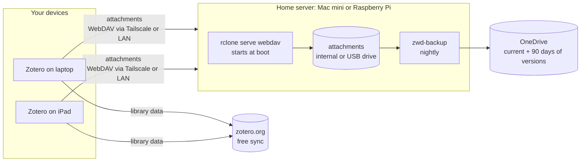

# Zotero WebDAV on a home server

Host your Zotero attachment files on an always-on machine at home instead of paying for Zotero Storage, and back them up to OneDrive every night. Runs on **macOS** (a Mac mini) or **Linux**, including a **Raspberry Pi 3 or later**.

Zotero syncs two things separately. Your **library data** (items, notes, tags, collections) always syncs through zotero.org, and that is free with no size limit. Your **attachment files** (PDFs, snapshots) can go either to Zotero Storage, which is paid beyond 300 MB, or to any WebDAV server you run yourself. This repo turns a Mac or a Pi into that WebDAV server.



## What you get

- **A WebDAV server** ([rclone](https://rclone.org/commands/rclone_serve_webdav/)) that starts at boot, runs as your user (not root), restarts if it crashes, and requires a password (stored as a bcrypt hash).
- **Nightly backups** to OneDrive. The backup keeps a mirror of your files plus previous versions of anything changed or deleted in the last 90 days, so a bad sync can't silently wipe the backup too.
- **Protection against a missing drive.** If the attachments are on an external drive that isn't mounted, the server and backup refuse to run, rather than serving an empty folder that Zotero would read as "everything was deleted".
- **Access from anywhere** through [Tailscale](https://tailscale.com), optionally with real HTTPS certificates, without opening ports on your router.
- **A health check** that tests login, write, read and delete, and warns if backups have stopped.

## Choosing a host

| Host | Good for | Guide |
|---|---|---|
| **Mac mini** (or any Mac that stays on) | Easiest if you already have one running. Backs up through the OneDrive app. | [Quick start](#quick-start-macos) below |
| **Raspberry Pi 3** | A free, silent, dedicated box. Plenty for serving PDFs; too small for Home Assistant nowadays. | [docs/raspberry-pi.md](docs/raspberry-pi.md) |
| **Raspberry Pi 4 / 5, Debian, Ubuntu** | Same as the Pi 3 guide, just faster. | [docs/raspberry-pi.md](docs/raspberry-pi.md) |

Keeping services you rely on off the machine you experiment with is worth a lot. A setup that works well: a **Pi 3 for Zotero**, a **Pi 4 for [Home Assistant](docs/pi4-home-assistant.md)**, and the Mac free to be a playground. The Home Assistant guide isn't needed for Zotero; it's included because it's the other half of that split.

## Quick start (macOS)

Requirements: macOS 13 or later with [Homebrew](https://brew.sh), and the OneDrive app signed in if you want the default backup.

```bash
git clone https://github.com/stevehaigh/zotero-webdav-macmini.git
cd zotero-webdav-macmini
./install.sh
```

The installer asks where to store attachments (default `~/ZoteroDAV`), then for a username and password (at least 12 characters), then for your Mac password once for `sudo`. It finishes by running a health check and printing the URL to use in Zotero.

Stop the Mac from sleeping, and have it restart after a power cut:

```bash
sudo pmset -a sleep 0 disksleep 0 autorestart 1
```

## Quick start (Raspberry Pi / Linux)

On Raspberry Pi OS Lite (64-bit), Debian or Ubuntu:

```bash
sudo apt install -y git
git clone https://github.com/stevehaigh/zotero-webdav-macmini.git
cd zotero-webdav-macmini
./install.sh
```

The same installer detects Linux and sets up systemd units instead of launchd. Backups go straight to OneDrive through rclone, which needs a one-off sign-in. The [Raspberry Pi guide](docs/raspberry-pi.md) covers the whole setup, including preparing a USB drive.

## Configure Zotero

In Zotero on each computer: **Settings → Sync → File Syncing**, choose **WebDAV** for My Library, and enter:

| Field    | At home (LAN)                | Anywhere (Tailscale)            |
|----------|------------------------------|---------------------------------|
| Scheme   | `http`                       | `http`, or `https` after [`zwd-tailscale-https`](docs/tailscale.md#real-https-with-tailscale-serve) |
| URL      | `<hostname>.local:8080`      | `<hostname>:8080` (the Tailscale machine name) |
| Username | the one you chose            | same                            |
| Password | the one you chose            | same                            |

Leave `/zotero/` off the end of the URL, since Zotero adds it. Click **Verify Server**. Full details, including the iOS app, are in [docs/zotero-client.md](docs/zotero-client.md).

**Moving from Zotero Storage?** Read [docs/migration.md](docs/migration.md) before switching. Zotero can only upload files it already has on disk, so you need to download everything first.

## Day-to-day commands

The installer puts these in `~/.local/share/zotero-webdav/bin`. Add that to your `PATH` (in `~/.zshrc` on a Mac, `~/.bashrc` on a Pi) to call them by name:

```bash
export PATH="$HOME/.local/share/zotero-webdav/bin:$PATH"
```

| Command | What it does |
|---|---|
| `zwd-healthcheck` | Checks that the services are running, the data drive is mounted, the server answers and demands a password, and the last backup is recent |
| `zwd-healthcheck --auth` | Also logs in and writes, reads and deletes a test file |
| `zwd-backup` | Runs the OneDrive backup now |
| `zwd-set-password` | Changes the username or password, then restarts the server |
| `zwd-tailscale-https` | Serves the WebDAV folder over HTTPS on your tailnet (`--off` to undo) |
| `zwd-serve` | Runs the server in the foreground (the service normally does this; useful for debugging) |

| | macOS | Linux |
|---|---|---|
| Restart the server | `sudo launchctl kickstart -k system/io.github.stevehaigh.zotero-webdav` | `sudo systemctl restart zotero-webdav` |
| Server log | `~/Library/Logs/zotero-webdav/server.log` | `journalctl -u zotero-webdav` |
| Backup log | `~/Library/Logs/zotero-webdav/backup.log` | `journalctl -u zotero-webdav-backup` |

## Where things live

| Path | Contents |
|---|---|
| `~/ZoteroDAV/zotero/` (or the folder you chose) | Your attachments, as Zotero stores them on WebDAV: one `KEY.zip` plus `KEY.prop` per attachment |
| `~/.config/zotero-webdav/config.env` | Settings: data folder, drive mount point, port, bind address, backup destination and schedule ([annotated example](config.example.env)) |
| `~/.config/zotero-webdav/htpasswd` | Username and bcrypt password hash (mode 600) |
| `~/.local/share/zotero-webdav/` | Installed copies of the scripts |
| macOS: `/Library/LaunchDaemons/io.github.stevehaigh.zotero-webdav.plist` | Starts the server at boot |
| macOS: `~/Library/LaunchAgents/io.github.stevehaigh.zotero-webdav-backup.plist` | Runs the backup nightly at 03:30 |
| Linux: `/etc/systemd/system/zotero-webdav.service` | Starts the server at boot |
| Linux: `/etc/systemd/system/zotero-webdav-backup.{service,timer}` | Runs the backup nightly at 03:30 |

On a Mac, the default data folder sits in your home folder rather than in `~/Documents` on purpose. macOS privacy controls block background services from Documents, Desktop and Downloads.

## Updating and uninstalling

To update, pull and re-run the installer. It keeps your config, password and data:

```bash
git pull && ./install.sh
```

To uninstall, run `./uninstall.sh`. It removes the services and scripts but never your attachments or backups. Add `--purge-config` to delete the config and password as well.

## Security notes

- **Don't forward a port on your router to this server.** Use Tailscale for access away from home. Nothing here is hardened for exposure to the open internet.
- On plain `http`, Zotero sends your password with every request. Over Tailscale that traffic is already encrypted by WireGuard. On your home LAN it is not, which is fine on a network you trust. For end-to-end HTTPS, run `zwd-tailscale-https` and set `BIND_ADDR="127.0.0.1"` so the server is only reachable through Tailscale.
- The WebDAV password protects only your attachments. Use a unique one; it is not your Zotero account password.

## Limitations

- **WebDAV covers My Library only.** Group libraries always store files on zotero.org, charged to the group owner's quota.
- **If the server is off, file sync pauses.** Nothing is lost: Zotero retries and catches up when the server is back. Library data keeps syncing through zotero.org regardless.

## More documentation

- [Raspberry Pi setup (Pi 3 and later)](docs/raspberry-pi.md)
- [Home Assistant on a Raspberry Pi 4](docs/pi4-home-assistant.md)
- [Configuring Zotero (desktop and iOS)](docs/zotero-client.md)
- [Migrating from Zotero Storage](docs/migration.md)
- [Remote access with Tailscale, including HTTPS](docs/tailscale.md)
- [Backups and restoring](docs/backup.md)
- [Troubleshooting](docs/troubleshooting.md)

## Licence

MIT. See [LICENSE](LICENSE).
