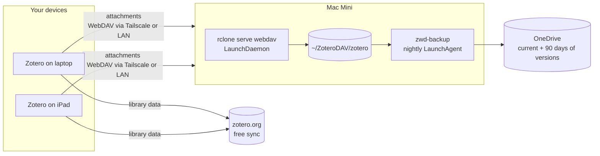

# Zotero WebDAV on a Mac Mini

Host your Zotero attachment files on an always-on Mac instead of paying for Zotero Storage, and back them up to OneDrive every night.

Zotero syncs two things separately. Your **library data** (items, notes, tags, collections) always syncs through zotero.org, and that is free with no size limit. Your **attachment files** (PDFs, snapshots) can go either to Zotero Storage, which is paid beyond 300 MB, or to any WebDAV server you run yourself. This repo turns a Mac Mini into that WebDAV server.



## What you get

- **A WebDAV server** ([rclone](https://rclone.org/commands/rclone_serve_webdav/)) that starts at boot, runs as your user (not root), restarts if it crashes, and requires a password (stored as a bcrypt hash).
- **Nightly backups** to OneDrive. The backup keeps a mirror of your files plus previous versions of anything changed or deleted in the last 90 days, so a bad sync can't silently wipe the backup too.
- **Access from anywhere** through [Tailscale](https://tailscale.com), optionally with real HTTPS certificates, without opening ports on your router.
- **A health check** that tests login, write, read and delete, and warns if backups have stopped.

## Requirements

- A Mac that stays on (macOS 13 or later is what this has been written for), with [Homebrew](https://brew.sh).
- Enough disk space for your attachments.
- The OneDrive app signed in on that Mac, if you want the default backup. Other options are in [docs/backup.md](docs/backup.md).
- Tailscale on the Mac and on each device, if you want to sync away from home. See [docs/tailscale.md](docs/tailscale.md).

## Quick start

On the Mac Mini:

```bash
git clone https://github.com/stevehaigh/zotero-webdav-macmini.git
cd zotero-webdav-macmini
./install.sh
```

The installer asks you to choose a username and password (the password needs at least 12 characters), then asks for your Mac password once for `sudo`. It finishes by running a health check and printing the URL to use in Zotero.

Stop the Mac from sleeping, or the server disappears at night:

```bash
sudo pmset -a sleep 0 disksleep 0
```

Then, in Zotero on each computer: **Settings → Sync → File Syncing**, choose **WebDAV** for My Library, and enter:

| Field    | At home (LAN)            | Anywhere (Tailscale)            |
|----------|--------------------------|---------------------------------|
| Scheme   | `http`                   | `http`, or `https` after [`zwd-tailscale-https`](docs/tailscale.md#real-https-with-tailscale-serve) |
| URL      | `mac-mini.local:8080`    | `mac-mini:8080` (the Tailscale machine name) |
| Username | the one you chose        | same                            |
| Password | the one you chose        | same                            |

Leave `/zotero/` off the end of the URL, since Zotero adds it. Click **Verify Server**. Full details, including the iOS app, are in [docs/zotero-client.md](docs/zotero-client.md).

**Moving from Zotero Storage?** Read [docs/migration.md](docs/migration.md) before switching. Zotero can only upload files it already has on disk, so you need to download everything first.

## Day-to-day commands

The installer puts these in `~/.local/share/zotero-webdav/bin`. Add that to your `PATH` to call them by name:

```bash
echo 'export PATH="$HOME/.local/share/zotero-webdav/bin:$PATH"' >> ~/.zshrc
```

| Command | What it does |
|---|---|
| `zwd-healthcheck` | Checks that the services are loaded, the server answers and demands a password, and the last backup is recent |
| `zwd-healthcheck --auth` | Also logs in and writes, reads and deletes a test file |
| `zwd-backup` | Runs the OneDrive backup now |
| `zwd-set-password` | Changes the username or password, then restarts the server |
| `zwd-tailscale-https` | Serves the WebDAV folder over HTTPS on your tailnet (`--off` to undo) |
| `zwd-serve` | Runs the server in the foreground (launchd normally does this; useful for debugging) |

Logs are in `~/Library/Logs/zotero-webdav/` (`server.log` and `backup.log`).

To restart the server after editing the config:

```bash
sudo launchctl kickstart -k system/io.github.stevehaigh.zotero-webdav
```

## Where things live

| Path | Contents |
|---|---|
| `~/ZoteroDAV/zotero/` | Your attachments, as Zotero stores them on WebDAV: one `KEY.zip` plus `KEY.prop` per attachment |
| `~/.config/zotero-webdav/config.env` | Settings: data folder, port, bind address, backup destination and schedule ([annotated example](config.example.env)) |
| `~/.config/zotero-webdav/htpasswd` | Username and bcrypt password hash (mode 600) |
| `~/.local/share/zotero-webdav/` | Installed copies of the scripts |
| `/Library/LaunchDaemons/io.github.stevehaigh.zotero-webdav.plist` | Starts the server at boot |
| `~/Library/LaunchAgents/io.github.stevehaigh.zotero-webdav-backup.plist` | Runs the backup nightly at 03:30 |
| `~/Library/Logs/zotero-webdav/` | Logs |

The data folder sits in your home folder rather than in `~/Documents` on purpose. macOS privacy controls block background services from Documents, Desktop and Downloads.

## Updating and uninstalling

To update, pull and re-run the installer. It keeps your config, password and data:

```bash
git pull && ./install.sh
```

To uninstall, run `./uninstall.sh`. It removes the services and scripts but never your attachments or backups. Add `--purge-config` to delete the config and password as well.

## Security notes

- **Don't forward a port on your router to this server.** Use Tailscale for access away from home. Nothing here is hardened for exposure to the open internet.
- On plain `http`, Zotero sends your password with every request. Over Tailscale that traffic is already encrypted by WireGuard. On your home LAN it is not, which is fine on a network you trust. For end-to-end HTTPS, run `zwd-tailscale-https` and set `BIND_ADDR="127.0.0.1"` so the server is only reachable through Tailscale.
- The WebDAV password protects only your attachments. Use a unique one; it is not your Zotero account password.

## Limitations

- **WebDAV covers My Library only.** Group libraries always store files on zotero.org, charged to the group owner's quota.
- **If the Mac is off, file sync pauses.** Nothing is lost: Zotero retries and catches up when the server is back. Library data keeps syncing through zotero.org regardless.
- **These are macOS scripts.** `zwd-serve` and `zwd-backup` also run on Linux, but the installer and launchd parts are macOS-only.

## More documentation

- [Configuring Zotero (desktop and iOS)](docs/zotero-client.md)
- [Migrating from Zotero Storage](docs/migration.md)
- [Remote access with Tailscale, including HTTPS](docs/tailscale.md)
- [Backups and restoring](docs/backup.md)
- [Troubleshooting](docs/troubleshooting.md)

## Licence

MIT. See [LICENSE](LICENSE).
